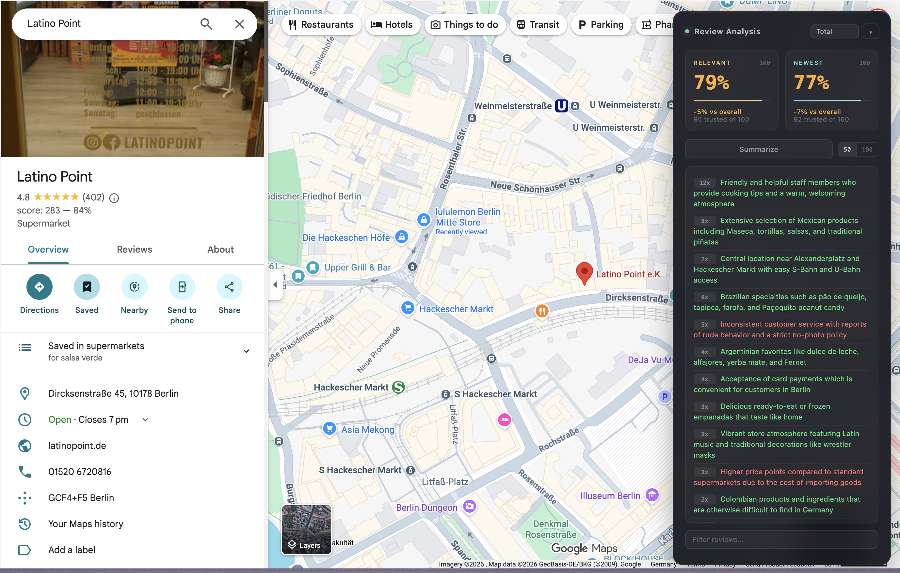

# Summarize Google Maps Reviews Extension

A Chrome extension that analyzes Google Maps reviews to give you a real quality score — filtering out fake accounts, comparing sort orders, and summarizing key themes with AI.



## Features

- **Trusted-only scoring** — Filters out reviews from accounts with fewer than 3 reviews to minimize fake/bot influence
- **Dual sort comparison** — Fetches both "Relevant" and "Newest" sorted reviews and shows scores for each, with a color-coded diff vs the overall rating
- **Time period breakdown** — View scores for Total, Past Year, or Past Month
- **AI-powered summaries** — Uses Gemini to extract specific highlights, value-for-money rating, and a verdict from up to 100 reviews
- **Search filter** — Filter reviews by keyword and see a focused score + AI summary for that topic specifically
- **Collapsible panel** — The whole UI collapses out of the way when not needed

## Setup

1. Clone or download this repo
2. Create a `config.js` file with your Gemini API key:
   ```js
   const GEMINI_API_KEY = 'your-api-key-here';
   ```
3. Open Chrome → `chrome://extensions` → Enable "Developer mode"
4. Click "Load unpacked" and select this folder

Visit any place on Google Maps to see the review analysis panel.
